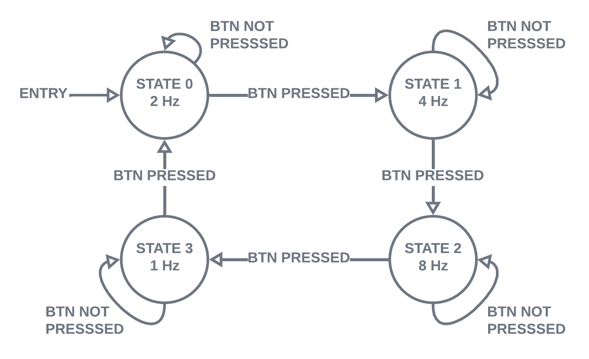

# Warm Up Project 0

## Submission Details
**Author:** Elvis Chino-Islas  
**Course:** COMP522  
**Course Name:** Embedded System Applications
**Completion Date:** 29 January 2023

## Program Description

This program is used to change the blinking frequency of the LED on-board the Arduino UNO microcontroller board. It specifically iterates between frequencies 2 Hz, 4 Hz, 8 Hz, and 1 Hz in the given order.

## Implementation Details

A finite state machine (FSM) was employed in the program to implement the functionality. The states are enumerated using an `enum` in the header file `blinky.h`. 

The state transition was handled in the function named `update_state`, the press of the button causes a state transition. The output was solely determined by the state, the output being the change of blinking frequency.

An interrupt was used for the push button which triggers on a falling edge as the pin connected to the button was set to have an pull-up resistor configured. The interrupt service routine (ISR) simply set a flag, `interrupt`, true whenever triggered.
The program would see this flag set and handle the input and set the flag back to false.

A state diagram of the FSM can be seen below:

